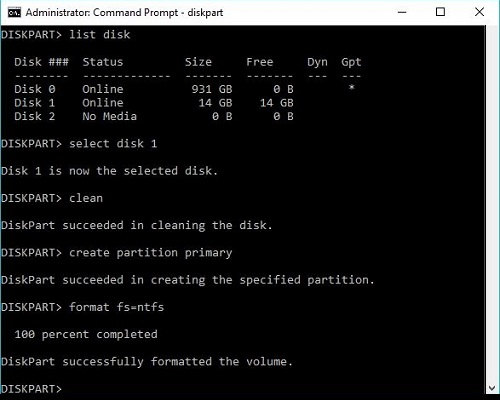

# Drive Preparation

All drives were wiped and initialised before going into the case. This is much easier to do with drives connected directly to a Windows laptop than it is to do later from inside the Pi.

**Tool used:** Windows `diskpart` (built in — no installation needed)

---

## Why Wipe the Drives First?

- Removes any old partition tables or file systems that could confuse the RAID setup later.
- Initialises each drive with a GPT partition table, which is required for drives larger than 2 TB.
- Confirms each drive is healthy and responsive before it goes into the enclosure.

---

## Steps (Repeat for Each Drive)

### 1. Connect the drive

Attach the drive to your Windows PC using a USB-to-SATA adapter, or plug it directly into a SATA port if available.

### 2. Open diskpart

Open **Command Prompt as Administrator** and type:

```
diskpart
```

### 3. List all disks

```
list disk
```

Carefully look at the output. Note the disk number, size, and any existing partitions. **Double-check you are selecting the right disk.**

### 4. Select the target disk

Replace `X` with the correct disk number:

```
select disk X
```

### 5. Wipe the disk

```
clean
```

> ⚠️ **This is irreversible. The `clean` command permanently destroys all data on the selected disk. Triple-check the disk number using `list disk` and comparing sizes before running this.**

### 6. Initialise with GPT

```
convert gpt
```

GPT (GUID Partition Table) is required for drives larger than 2 TB.

### 7. Exit and repeat

```
exit
```

Repeat the entire process for each drive.

---

## Example Output

```
DISKPART> list disk

  Disk ###  Status         Size     Free     Dyn  Gpt
  --------  -------------  -------  -------  ---  ---
  Disk 0    Online          238 GB      0 B         *
  Disk 1    Online         3726 GB  3726 GB
  Disk 2    Online         3726 GB  3726 GB
  Disk 3    Online         3726 GB  3726 GB
  Disk 4    Online          931 GB   931 GB

DISKPART> select disk 1
Disk 1 is now the selected disk.

DISKPART> clean
DiskPart succeeded in cleaning the disk.

DISKPART> convert gpt
DiskPart successfully converted the selected disk to GPT format.
```

In this example, Disk 0 is the laptop's internal drive — **do not touch it**. Disks 1–3 are the 4 TB SAS drives, and Disk 4 is the 1 TB SATA drive.



---

[← Component Verification](component-verification.md) | [Next: Mechanical Assembly →](mechanical-assembly.md)
