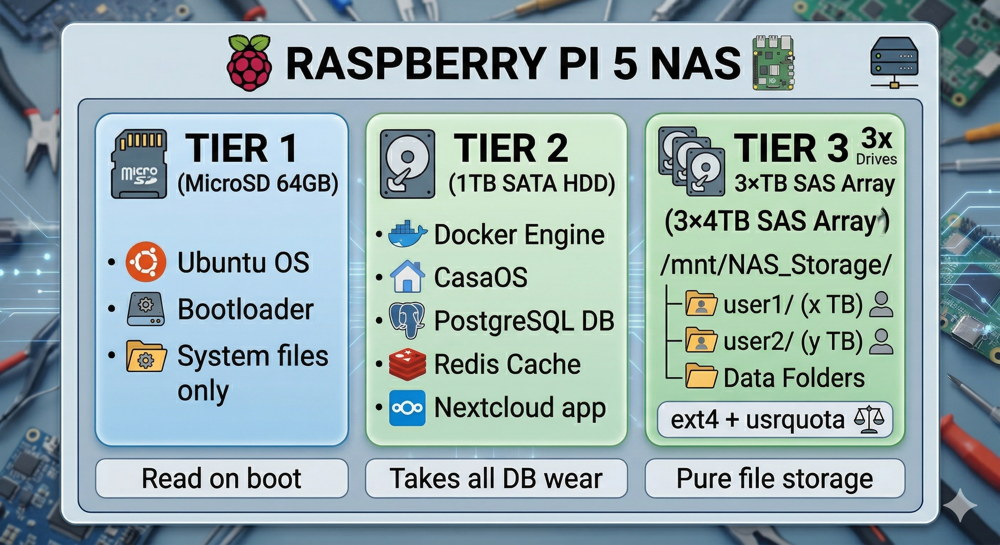

# 04. Storage Configuration

This section covers building the RAID 5 array, installing CasaOS, mounting the drives permanently, and verifying everything is healthy before opening the system to users.

---

## Sub-Sections

| File                                               | Content                                             |
| -------------------------------------------------- | --------------------------------------------------- |
| [Drive Identification](drive-identification.md)    | Confirming drive names safely before formatting     |
| [RAID 5 Setup](raid-setup.md)                      | Building the 8 TB RAID 5 array with mdadm           |
| [CasaOS Installation](casaos-install.md)           | Installing the web dashboard                        |
| [Permanent Mounting](permanent-mount.md)           | fstab entry and surviving reboots                   |
| [Debug — RAID Reboot Issues](debug-raid-reboot.md) | Fixing md127, inactive arrays, and read-only locks  |
| [RAID Verification](raid-verification.md)          | Four commands to confirm the array is fully healthy |

---

[← Back to OS Setup](../03-os-setup/README.md) | [Next: User Management →](../05-user-management/README.md)
