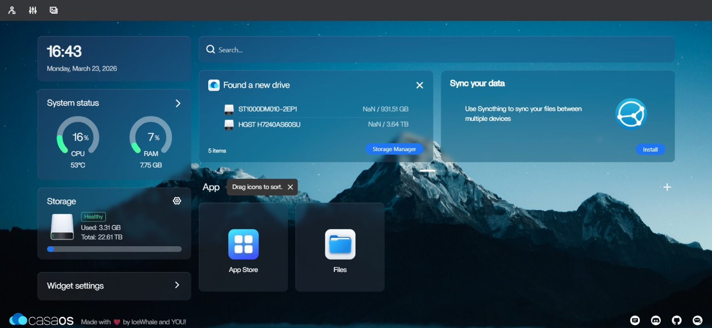

# CasaOS Installation

CasaOS is installed on top of Ubuntu Server to provide a visual web dashboard for managing containers, files, and storage. It takes about 2 to 5 minutes to install.

---

## Install CasaOS

Run the official one-line installer:

```bash
curl -fsSL https://get.casaos.io | sudo bash
```

This installs CasaOS, Docker, and all necessary background services automatically.

---

## Access the Dashboard

When installation finishes, the terminal displays your Raspberry Pi's local IP address. Open a web browser on any computer on the same network and navigate to that IP:

```
http://192.168.1.100
```

Create your CasaOS admin account on first load.



---

## Mount the Drives in CasaOS

Once you are on the dashboard:

1. Open the **Storage Manager** app (hard drive icon).
2. You will see `/dev/md0` (the 8 TB RAID array) and your 1 TB drive listed under **Available Storage**.
3. Click **Create Storage** for both.

CasaOS will format and mount the drives and they will appear in the Files app.

---

## What CasaOS Manages vs What Ubuntu Manages

It is important to understand that CasaOS is a visual layer — Ubuntu still handles everything underneath.

| Task                              | Handled By       |
| --------------------------------- | ---------------- |
| RAID array management             | Ubuntu (`mdadm`) |
| User accounts and quotas          | Ubuntu (Linux)   |
| File permissions                  | Ubuntu (Linux)   |
| Installing apps (Nextcloud, etc.) | CasaOS (Docker)  |
| File browsing                     | CasaOS (web UI)  |
| Container management              | CasaOS (Docker)  |

---

[← RAID 5 Setup](raid-setup.md) | [Next: Permanent Mounting →](permanent-mount.md)
