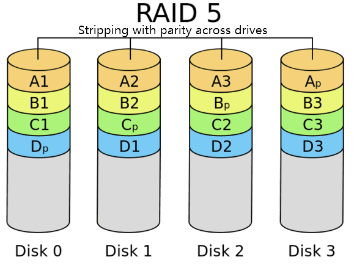

# RAID 5 Setup

This step combines the three 4 TB SAS drives into a single protected virtual drive called `/dev/md0` using RAID 5.

---

## What Is RAID 5?

RAID 5 stripes data across all drives and stores parity information distributed across them. This means:

- **One drive can fail** and all your data is still safe
- **Usable capacity** = (number of drives − 1) × drive size = 2 × 4 TB = **~8 TB**
- **Read performance** is better than a single drive
- **Write performance** is slightly lower due to parity calculations

   

> ⚠️ RAID is not a backup. It protects against a single drive failure, but not against accidental deletion, ransomware, or simultaneous failure of two or more drives. Keep a separate backup for anything important.

---

## Step 1 — Install mdadm

```bash
sudo apt update && sudo apt install mdadm -y
```

---

## Step 2 — Create the RAID 5 Array

> 🚨 Replace `sda`, `sdb`, `sdc` with the actual drive names from your [drive identification](drive-identification.md) step.

```bash
sudo mdadm --create --verbose /dev/md0 \
  --level=5 \
  --raid-devices=3 \
  /dev/sda /dev/sdb /dev/sdc
```

If prompted to confirm, type `y` and press Enter.

The array will be created immediately, but it will start a **background sync** (called a resync or initial parity build). This is normal and takes several hours for large drives. The array is fully usable during the sync.

---

## Step 3 — Format the RAID Array

```bash
sudo mkfs.ext4 /dev/md0
```

---

## Step 4 — Format the 1 TB Web Server Drive

> 🚨 Replace `sdd` with the actual name of your 1 TB drive.

```bash
sudo mkfs.ext4 /dev/sdd
```

---

## Step 5 — Create Mount Points

```bash
sudo mkdir -p /mnt/NAS_Storage
sudo mkdir -p /mnt/Web_Server
```

---

## Step 6 — Mount Both Drives

```bash
sudo mount /dev/md0 /mnt/NAS_Storage
sudo mount /dev/sdd /mnt/Web_Server
```

---

## Monitor the Sync Progress

You can watch the background sync progress at any time:

```bash
cat /proc/mdstat
```

Example output during sync:

```
Personalities : [raid6] [raid5] [raid4]
md0 : active raid5 sda[0] sdb[1] sdc[2]
      7813772288 blocks super 1.2 level 5, 512k chunk, ...
      [3/3] [UUU]
      [=======>.............]  resync = 38.2% (994534400/2604590762) ...
```

When complete, the progress bar disappears and the status shows `[3/3] [UUU]`.

Sync time varies — expect **6 to 12 hours** for three 4 TB drives.

---

[← Drive Identification](drive-identification.md) | [Next: CasaOS Installation →](casaos-install.md)
