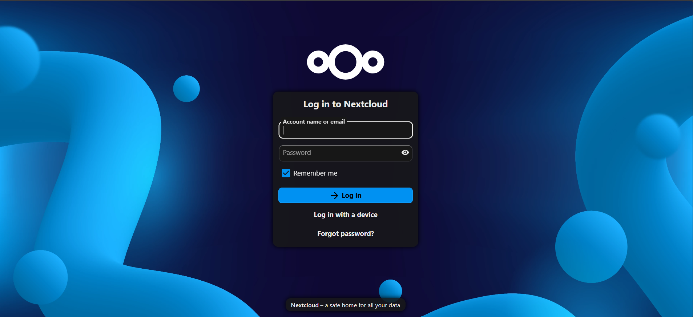
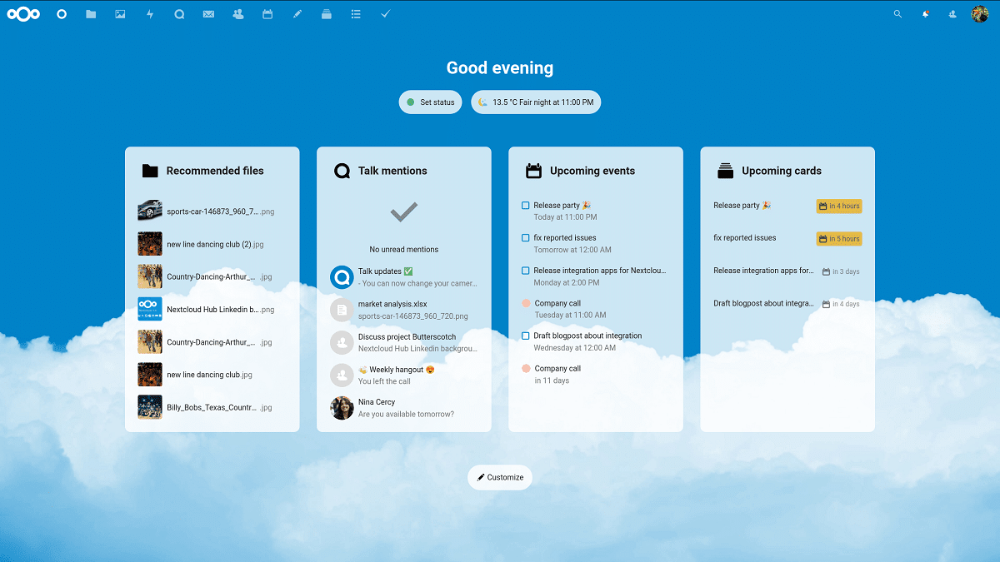

# Initial Setup

After the container starts, the first login and trusted domain configuration needs to be done before Nextcloud is usable.

---

## Step 1 — First Login

Open the Nextcloud container from the CasaOS dashboard. Because this build used the "Big Bear" Nextcloud image from the custom app store, it auto-generates admin credentials.



**Default credentials:**

| Field    | Value    |
| -------- | -------- |
| Username | `casaos` |
| Password | `casaos` |

If these do not work, check the CasaOS container settings (three dots → Settings → Environment Variables) and look for `NEXTCLOUD_ADMIN_USER` and `NEXTCLOUD_ADMIN_PASSWORD`.



---

## Step 2 — Change the Admin Password

Do this immediately before anything else.

1. Click the **profile icon** in the top right corner.
2. Click **Personal Settings**.
3. On the left sidebar, click **Security**.
4. Enter and save a new, strong password.

---

## Step 3 — Fix the Trusted Domain Error

On first access, Nextcloud may show an **"Access through untrusted domain"** error. This is Nextcloud's built-in security checking that you are connecting through a recognised address.


Open the config file:

```bash
sudo nano /mnt/Web_Server/Nextcloud_Brain/config/config.php
```

Find the `trusted_domains` array and update it to include your Pi's local IP and hostname:

```php
'trusted_domains' =>
  array (
    0 => 'localhost',
    1 => '192.168.1.100',
    2 => 'pinas.local',
  ),
```

Save and exit (`Ctrl+O`, `Enter`, `Ctrl+X`), then refresh the browser. The error will be gone.

---

## Step 4 — Create User Accounts in Nextcloud

1. Click the **profile icon** and select **Users**.
2. Click **New user**.
3. Create an account for `alice` and assign a password.
4. Create an account for `bob` and assign a password.

> ⚠️ These Nextcloud accounts are separate from the Linux system accounts. Users will use these credentials to log into the Nextcloud web interface and apps.

---

[← CasaOS Installation](casaos-install.md) | [Next: Connect User Vaults →](connect-vaults.md)
