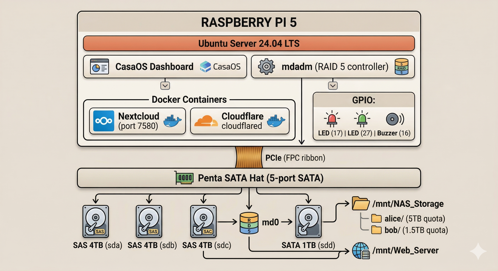
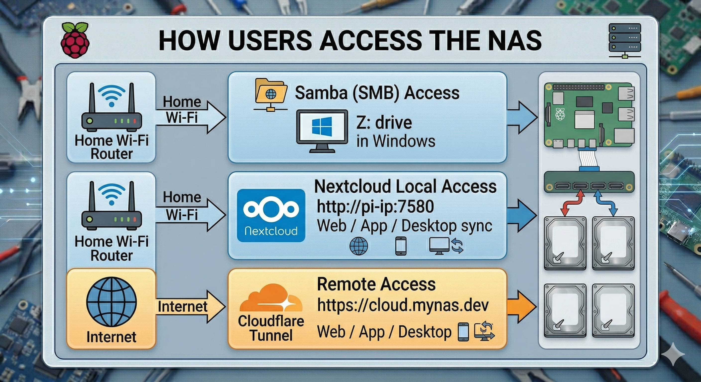

# What Was Built

A complete summary of the finished system.

---

## Capabilities

| Feature               | Detail                                                    |
| --------------------- | --------------------------------------------------------- |
| Storage capacity      | ~8 TB usable (RAID 5 across 3 × 4 TB drives)              |
| Fault tolerance       | One drive can fail with zero data loss                    |
| Dedicated app storage | 1 TB drive for Nextcloud, database, and cache             |
| Users                 | Admin + 2 regular users (Alice and Bob)                   |
| User isolation        | Each user can only access their own folder                |
| Storage quotas        | Alice: 5 TB hard limit, Bob: 1.5 TB hard limit            |
| Local network access  | Samba (SMB) — mapped Windows drives                       |
| Cloud sync            | Nextcloud — OneDrive-style on web, mobile, and desktop    |
| Internet access       | Cloudflare Zero Trust Tunnel — no open ports              |
| Hardware monitoring   | GPIO LEDs + temperature buzzer via Python systemd service |
| OS                    | Ubuntu Server 24.04 LTS + CasaOS dashboard                |

---

## Final Architecture

---

## Access Methods

---

## Stack Summary

| Layer            | Technology                                 |
| ---------------- | ------------------------------------------ |
| Hardware compute | Raspberry Pi 5 (8 GB)                      |
| SATA controller  | Geekworm Penta SATA Hat (PCIe)             |
| Power            | ATX desktop PSU → 12V DC barrel jack       |
| OS               | Ubuntu Server 24.04 LTS                    |
| RAID             | mdadm software RAID 5                      |
| Dashboard        | CasaOS                                     |
| Cloud platform   | Nextcloud (Docker)                         |
| Local sharing    | Samba (SMB)                                |
| Internet tunnel  | Cloudflare Zero Trust (cloudflared Docker) |
| User isolation   | Linux ACLs + ext4 journaled quotas         |
| Monitoring       | Python + gpiozero + systemd                |

---

[← Summary Overview](README.md) | [Next: Maintenance Reference →](maintenance.md)
