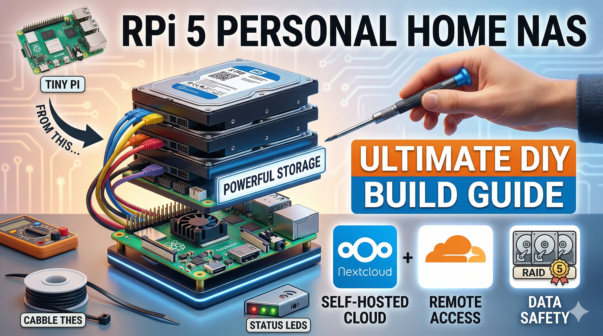

# 🖥️ Raspberry Pi Personal Home NAS

> **From Tiny Pi to Powerful Storage — A Complete DIY Build Guide**

This is a full documentation set for building a personal Network Attached Storage (NAS) server using a Raspberry Pi 5. The project covers everything from hardware assembly to cloud access via Nextcloud and Cloudflare.

<button style="background-color: #2d9777; color: white; padding: 10px 20px; border: none; border-radius: 5px; cursor: pointer;" onclick="window.open('./docs/NAS_Project_Report.pdf', '_blank')">Download Full Project Report (PDF)</button>

---

## 📋 What This Build Does

- **~8 TB of RAID 5 protected storage** using three enterprise SAS drives
- **1 TB dedicated drive** for web server and application data
- **Hardware health monitoring** via GPIO LEDs and a temperature buzzer
- **Per-user isolated storage vaults** with hard disk quotas
- **Local network sharing** via Samba (Windows mapped drives)
- **OneDrive-style sync** through a self-hosted Nextcloud instance
- **Secure internet access** via Cloudflare Zero Trust Tunnel (no open ports)

---

## 📚 Documentation Sections

| #   | Section                                         | Description                                 |
| --- | ----------------------------------------------- | ------------------------------------------- |
| 1   | [Overview](01-overview/README.md)               | Project goals and scope                     |
| 2   | [Hardware Configuration](02-hardware/README.md) | Components, assembly, and wiring            |
| 3   | [OS Setup](03-os-setup/README.md)               | Ubuntu Server install and health monitoring |
| 4   | [Storage Configuration](04-storage/README.md)   | RAID 5, CasaOS, and drive mounting          |
| 5   | [User Management](05-user-management/README.md) | User accounts, quotas, and Samba sharing    |
| 6   | [Nextcloud Setup](06-nextcloud/README.md)       | Self-hosted cloud sync platform             |
| 7   | [Internet Access](07-internet-access/README.md) | Cloudflare tunnel for remote access         |
| 8   | [Client Setup](08-client-setup/README.md)       | Web, mobile, and desktop clients            |
| 9   | [Project Summary](09-summary/README.md)         | Final architecture and maintenance notes    |

---

## 🛠️ Tech Stack

| Layer           | Technology                               |
| --------------- | ---------------------------------------- |
| Hardware        | Raspberry Pi 5 + Geekworm Penta SATA Hat |
| OS              | Ubuntu Server 24.04 LTS                  |
| Dashboard       | CasaOS                                   |
| Cloud Sync      | Nextcloud (Docker)                       |
| Local Network   | Samba (SMB)                              |
| Internet Access | Cloudflare Zero Trust Tunnel             |
| User Isolation  | Linux ACLs + Disk Quotas                 |
| Monitoring      | Python + GPIO + systemd                  |

---

## ⚡ Quick Start

If you want to follow this build from scratch, start at [Section 2 — Hardware Configuration](02-hardware/README.md) and work through each section in order.

If you already have hardware assembled and Ubuntu running, jump straight to [Section 4 — Storage Configuration](04-storage/README.md).

---

## 📝 Notes

- All usernames, domain names, and IP addresses in this guide are examples. Replace them with your own values.
- This project was built and documented by **Bimsara Gawesh** in March 2026.
- The system is currently live and serving two users with full internet access.# 🖥️ Raspberry Pi Personal Home NAS

> **From Tiny Pi to Powerful Storage — A Complete DIY Build Guide**

This is a full documentation set for building a personal Network Attached Storage (NAS) server using a Raspberry Pi 5. The project covers everything from hardware assembly to cloud access via Nextcloud and Cloudflare.

---

## License
This project is licensed under the MIT License. See the [LICENSE](./LICENSE) file for details.
