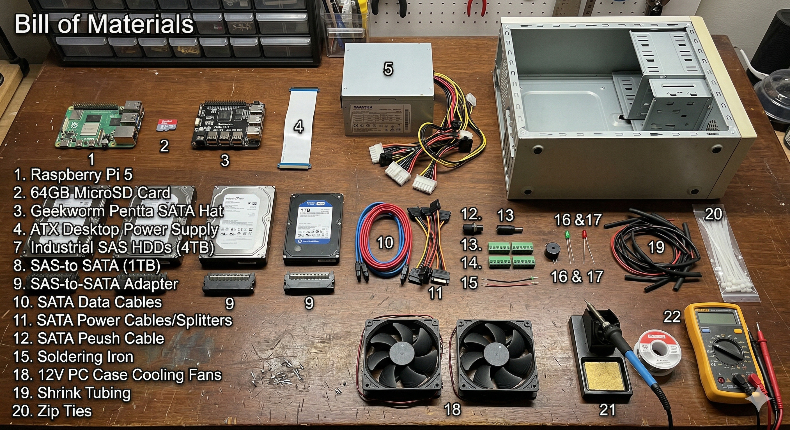

# Phase 1 - Bill of Materials

| #   | Component                     | Quantity  | Notes                                 |
| --- | ----------------------------- | --------- | ------------------------------------- |
| 1   | Raspberry Pi 5                | 1         | Main compute board                    |
| 2   | MicroSD Card (64GB)           | 1         | OS boot drive                         |
| 3   | Geekworm Penta SATA Hat       | 1         | Supports up to 5 SATA drives via PCIe |
| 4   | PCIe FPC Ribbon Cable         | 1         | Connects Pi 5 to Penta SATA Hat       |
| 5   | ATX Desktop Power Supply      | 1         | Powers drives and the Pi              |
| 6   | Old Desktop PC Case           | 1         | Enclosure with existing fans & LEDs   |
| 7   | Industrial SAS HDDs (4TB)     | 3         | Enterprise-grade drives               |
| 8   | SATA HDD (1TB)                | 1         | Standard desktop drive                |
| 9   | SAS-to-SATA Adapters          | 3         | One per SAS drive                     |
| 10  | SATA Data Cables              | 4         | One per drive                         |
| 11  | SATA Power Cables / Splitters | As needed | From ATX PSU                          |
| 12  | Latching Push Button          | 1         | Replaces momentary power switch       |
| 13  | Male DC Barrel Jack           | 1         | For Pi power input via SATA Hat       |
| 14  | Terminal Block Connectors     | Several   | For safe wire terminations            |
| 15  | Active 5V Buzzer              | 1         | Temperature warning alert             |
| 16  | Green LED (Power Indicator)   | 1         | Already in PC case                    |
| 17  | Red LED (Disk Activity)       | 1         | Already in PC case                    |
| 18  | PC Case Cooling Fans (12V)    | 2         | Additional ventilation                |
| 19  | Shrink Tubing                 | Assorted  | For connection insulation             |
| 20  | Zip Ties                      | Pack      | Cable management                      |
| 21  | Soldering Iron + Solder       | 1 set     | For wiring connections                |
| 22  | Multimeter                    | 1         | For continuity and voltage checks     |

---
