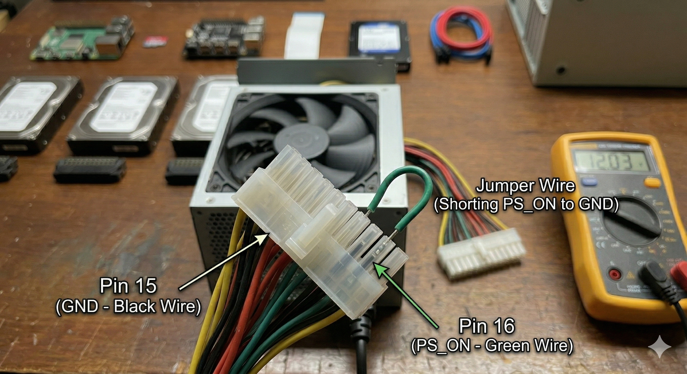

# Phase 1 — Component Verification

Before assembling anything, every component should be individually tested to avoid diagnosing failures inside a fully built system.

**Steps:**

1. **Raspberry Pi 5** — Connect the Pi to a monitor via micro-HDMI, attach a USB keyboard, and insert the SD card. Power it on and confirm it boots. If testing bare (no OS), verify the bootloader screen appears.

2. **MicroSD Card (64GB)** — Use [Raspberry Pi Imager](https://www.raspberrypi.com/software/) on your PC to write Raspberry Pi OS to the card. Verify the write completes without errors.

3. **Penta SATA Hat** — Inspect the board for physical damage. Do not power it yet; it will be verified after full assembly.

4. **ATX Power Supply** — Perform a **paperclip test** to confirm the PSU powers on independently:
   - Locate the 24-pin ATX connector.
   - Short the **PS_ON** pin (pin 16, green wire) to any **GND** pin (black wire) using a paperclip or jumper wire.
   - Plug the PSU into mains power and switch it on.
   - Confirm the PSU fan spins and measure ~12V on any yellow wire (relative to black) using a multimeter.
   - Power off and remove the jumper before continuing.

   

5. **SAS Drives** — If possible, connect each drive individually to a PC with an HBA card or external SAS enclosure to confirm the drives spin up and are detected.

6. **SATA HDD (1TB)** — Connect to a SATA port on a PC and confirm detection in Disk Management / `lsblk`.

7. **SAS-to-SATA Adapters** — Visually inspect for bent pins. Fit each adapter onto a SAS drive and confirm it seats firmly.
   

8. **PC Case** — Check that the power button, LEDs, and any existing fans are physically intact. Test fans by applying 12V from a power source if available.
