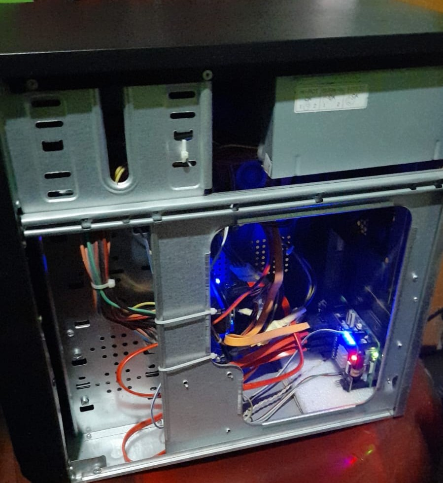

# Phase 10 — Cooling & Cable Management

Adequate airflow is critical for maintaining safe operating temperatures across the drives, the Raspberry Pi, and the Hat's bridge chip.

## 10a — Add Cooling Fans

1. **Mount two additional 80mm or 120mm PC fans** in available fan mounts in the case (typically front intake and rear exhaust).

2. Connect fan power to **12V (yellow) and GND (black)** from the ATX PSU using Molex-to-fan adapters or directly via terminal blocks.

3. Orient fans to create a **front-to-back airflow path** through the case — intake at the front pulling air past the drives, exhaust at the rear expelling hot air.

**Recommended airflow layout:**

```
[Front Fan — Intake] → [HDD Bay] → [Pi + SATA Hat] → [Rear Fan — Exhaust]
                                                   ↑
                                          [PSU — separate exhaust]
```

## 10b — Cable Management

1. **Group cables by type** — power cables together, data cables together, GPIO signal wires together.

2. **Use zip ties** at regular intervals (every 10–15 cm) to bundle cables neatly and route them along the case frame, away from fan blades.

3. **Use shrink tubing** on every exposed solder joint and any point where wires were spliced or joined.

4. **Leave service loops** — a small amount of slack near connectors so cables can be unplugged without straining the joint.

5. Ensure no cables obstruct fan blades or block airflow channels through the drive bay area.

   
