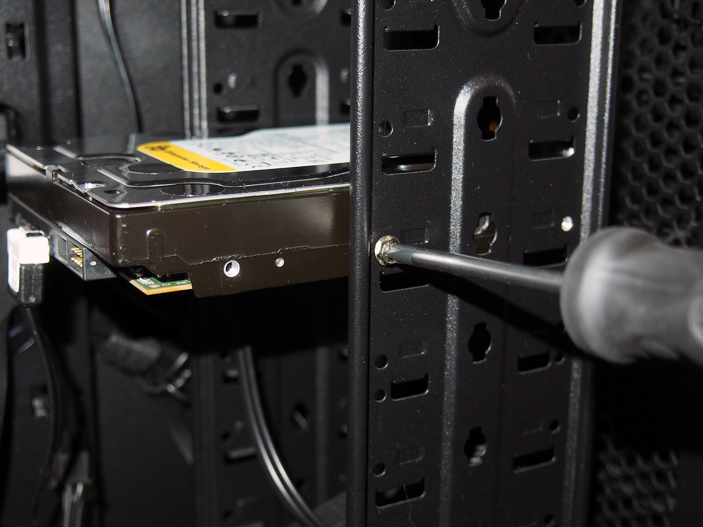
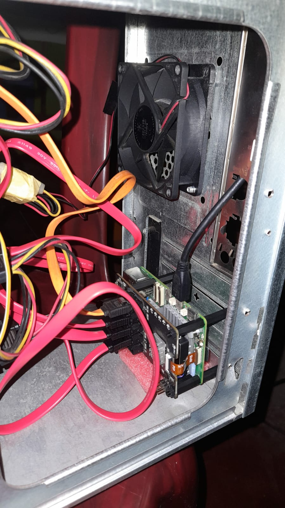

# Phase 3 — Mechanical Assembly

With drives tested and prepared, mount everything securely inside the PC case.

**Steps:**

1. **Remove the case side panels** and identify the drive bays (3.5" bays for HDDs).

2. **Mount each HDD** into a drive bay using the appropriate screws (usually M3 or UNC 6-32). Ensure the SATA connector end of each drive is easily accessible for cable routing.

3. **Arrange drives** to allow airflow between them — do not pack drives tightly against each other. Leave at least one bay gap between drives if the bay layout permits.

   

4. **Mount the ATX PSU** into the PSU bracket at the rear of the case (if not already installed) and secure with the four retaining screws.

5. **Plan the Raspberry Pi mounting location** — ideally somewhere with good airflow, away from the PSU fan exhaust. You can use standoffs, a 3D-printed bracket, or adhesive standoff pads. The Pi should be accessible for SD card and USB connections.

   

6. **Route cables loosely** at this stage — final cable management is done in Phase 9.
