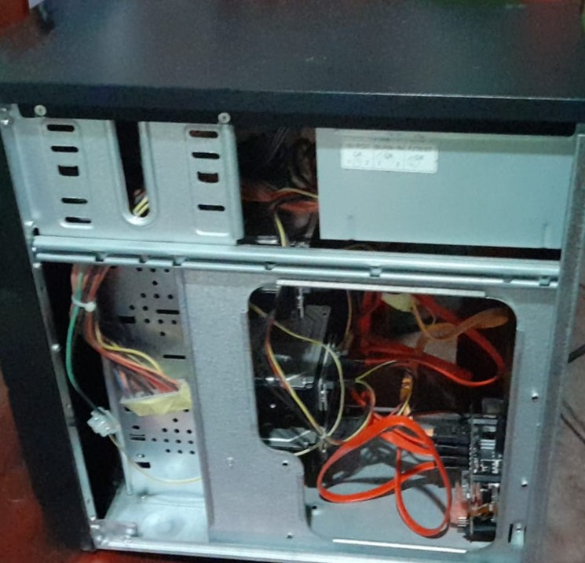

# Phase 4 — Drive Connectivity

Connect the SAS drives via adapters and wire all drives to the Penta SATA Hat.

**Steps:**

1. **Attach SAS-to-SATA adapters** to each of the three SAS drives. Press firmly until fully seated — these can be tight. Verify the adapter is not at an angle.

2. **Connect SATA data cables** from each drive (including the 1TB SATA HDD) to the corresponding SATA ports on the Penta SATA Hat. The Hat supports up to 5 drives; label or note which port connects to which drive for later software configuration.

3. **Connect SATA power cables** from the ATX PSU to each drive. SAS drives with SATA adapters accept standard SATA power connectors. If the PSU does not have enough SATA power connectors, use a SATA power splitter.

4. Gently tug each connection to verify it is locked in place.

