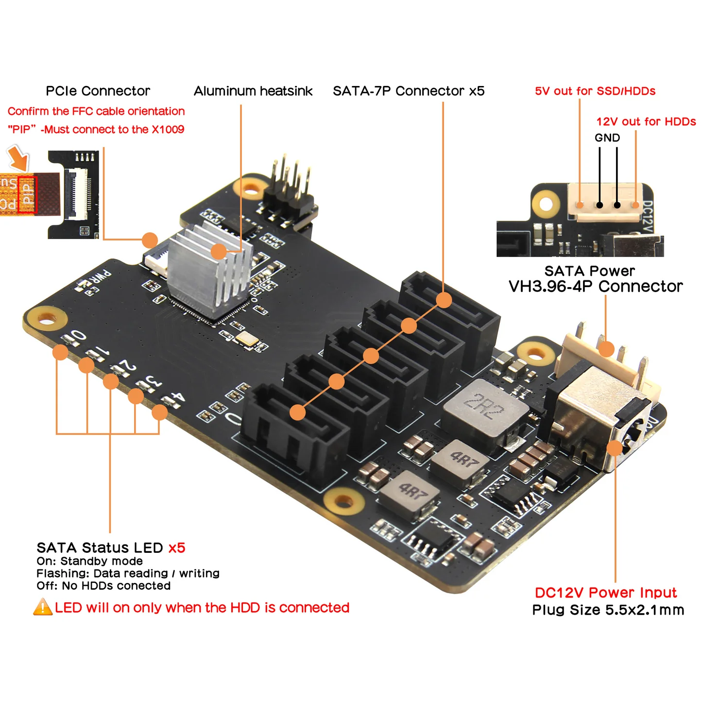
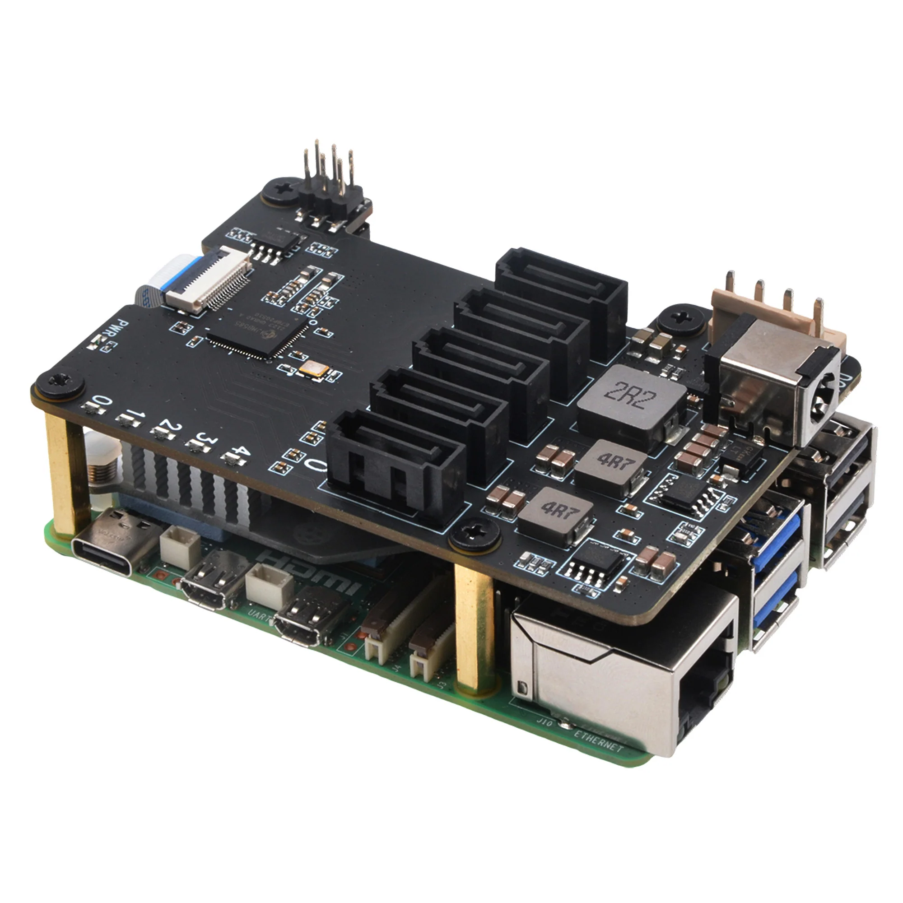
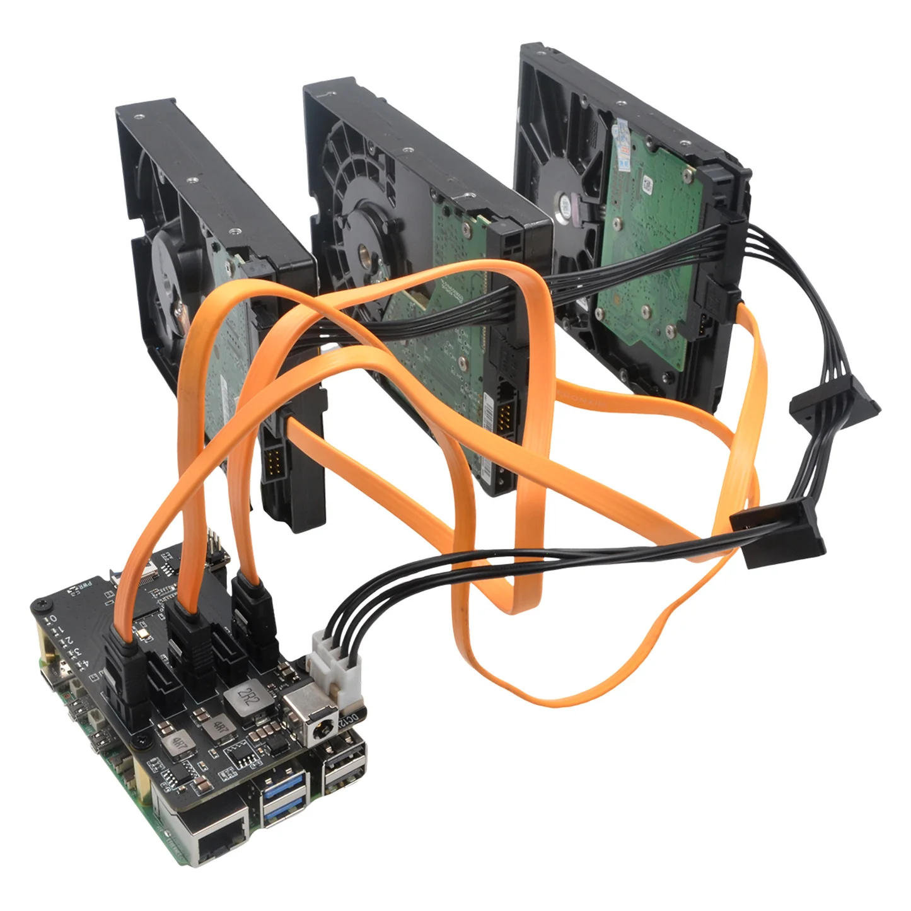

# Phase 8 — Penta SATA Hat & PCIe Connection

The Geekworm Penta SATA Hat connects to the Raspberry Pi 5 via its PCIe FPC interface, which is the primary data bus for all connected drives.

**Steps:**

1. **Attach the cooling fan** supplied with the Penta SATA Hat to the Hat's fan connector. Ensure the fan is oriented to draw air **across the Hat's bridge chip** (the large IC on the board).

   

2. **Connect the PCIe FPC ribbon cable:**
   - Open the FPC latch on the **Raspberry Pi 5's PCIe connector** (labelled `J2` on the board).
   - Insert the FPC cable with the **contacts facing down** (towards the board).
   - Close the latch firmly until it clicks.
   - Connect the other end of the FPC cable to the Penta SATA Hat's PCIe FPC connector in the same manner.

3. **Position the Penta SATA Hat** — it should be mounted on standoffs above or beside the Pi, not directly stacked (the Hat connects via the PCIe cable, not the 40-pin GPIO header, which remains free).

   

4. Verify the FPC cable has no sharp bends or kinks — keep the bend radius gentle.

   
